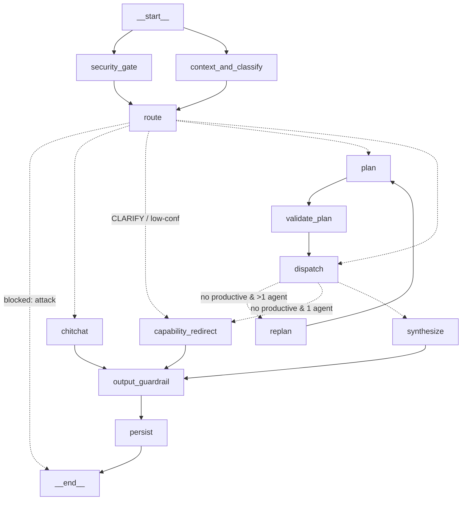
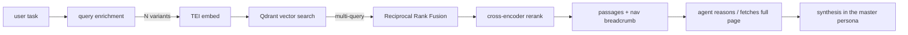

# FortiRecon Assistant — Agent Architecture

**FortiRecon Assistant** is a conversational multi-agent assistant built on the
**supervisor / orchestrator-workers** pattern. A central LangGraph **master
orchestrator** owns control flow deterministically: it screens for attacks, classifies
intent, routes to a team of **named specialist agents**, dispatches them (in parallel
where possible), reflects on the results, and synthesizes one answer in a single,
consistent persona. Sub-agents never talk to each other or to the user directly — the
supervisor coordinates, which keeps behavior predictable, debuggable, and safe.

The specialists are internal (`display_name` in the registry); the user hears one voice:

| Specialist | Capability area (`domain_label`) | Backing | Status |
|-----------|----------------------------------|---------|--------|
| **Atlas** (`id=atlas`) | FortiRecon product guidance | docs corpus (Qdrant) | enabled |
| **Sentinel** (`id=sentinel`) | Security reports & threat intel | reports corpus (Qdrant) | planned |
| **Aura** (`id=aura`) | External attack surface | EASM data via MCP | future |

Two properties define this system and are the through-line of the rest of this doc:

1. **The master's identity is DERIVED from the enabled specialists, not hardcoded.**
   Turn agents on/off via `ENABLED_AGENTS` and the whole personality (name, scope,
   refusal boundaries, capability advertising) reshapes automatically. The master name
   (`ASSISTANT_NAME`, e.g. "FortiRecon Assistant") is separate from any specialist; the
   user-facing scope is built from each specialist's `domain_label`, never its internal
   name. Today only Atlas is enabled, so the assistant presents as a product guide; it
   broadens the moment you enable more — with no prompt or code edits.
2. **It never cold-rejects a user.** Scope is decided only by the live capability set,
   and a graceful "here's what I can do" path guarantees no benign turn dead-ends.

---

## 1. Pipeline (LangGraph StateGraph)



- **`security_gate` ∥ `context_and_classify`** run concurrently (the two pre-routing
  LLM calls), joined at **`route`** — saves a round-trip. The classification of a
  blocked query is computed but never acted on.
- **`route`** branches on merged state: `blocked` → END; `chitchat` (DIRECT); `plan`
  (COMPLEX → planner); `dispatch` (router produced a SIMPLE plan inline);
  `capability_redirect` (CLARIFY / low-confidence — the graceful terminal).
- **`dispatch`** runs agents in topological parallel batches; the **reflection gate**
  then routes to `synthesize` (productive), `replan` (nothing productive, >1 agent,
  one retry left), or `capability_redirect` (single-agent miss / retries exhausted).
- **`output_guardrail`** (PII redaction + prompt-leak backstop) runs on **every**
  answer path — agent, chitchat, and capability_redirect — then **`persist`**.

**Streaming.** Token events stream to the UI only from `synthesize`, `chitchat`, and
`capability_redirect`; a `StreamingRedactor` redacts PII mid-stream so nothing
sensitive flashes before the final answer.

---

## 2. Derived identity — the personality follows the capabilities

`agents/identity.py :: SystemProfile` is built once at startup from whatever agents
actually registered:

| Field | Source | Used by |
|-------|--------|---------|
| `name` | `ASSISTANT_NAME` (`"FortiRecon Assistant"`) — the MASTER, never a specialist | persona, router, chitchat, redirect, `/v1/meta`, UI |
| `tagline` | `ASSISTANT_TAGLINE` or auto-derived | persona opening line |
| `scope` | each specialist's `domain_label` + description | persona "what I can help with" |
| `domains` | enabled specialists' `domain_label`s (capability areas, NOT agent names) | boundaries, redirects, DIRECT steering |
| `catalog` | `registry.build_agent_catalog()` | router + planner (single source of truth) |

Every persona-bearing prompt (`prompts/orchestrator.py`, `prompts/planner.py`, the
security classifier) is a **template** parameterized on this profile. Nothing says
"security assistant" or "user guide" unless the enabled specialists make it so. Enable
`sentinel`+`aura` and the master describes itself as covering security reports and attack
surface; ship only Atlas and it's a friendly product assistant — same code, same prompts.

> **The master vs its specialists.** "FortiRecon Assistant" is the *master* the user
> talks to. Atlas (`id=atlas`), Sentinel (`id=sentinel`), and Aura are
> *internal named specialists*. Their names never reach the user (one voice); the
> user-facing scope comes from each specialist's `domain_label`. Add a specialist and
> the master's advertised scope grows; the master's own name never changes.

---

## 3. Capability gating (which agents are active)

`ENABLED_AGENTS` (comma-separated allowlist, blank = everything available) is the
supported way to turn capabilities on/off with **no code change**. A gated-off agent
is never registered, so it never appears in the catalog, the persona, or the router —
the system reshapes end-to-end.

```
ENABLED_AGENTS=atlas                     # ship config: only the Atlas specialist
ENABLED_AGENTS=sentinel,aura,atlas       # bring the security capabilities online
ENABLED_AGENTS=                          # everything that is available
```

Availability is still gated on reality: `atlas` registers only when its Qdrant
corpus is populated; MCP agents register only when their server returns tools.

---

## 4. Routing — attempt-first, never cold-reject

Two-tier, cost-aware, and **incapable of a scope-rejection**:

1. **Router / classify** (FAST lane, `RouterDecision` via structured output) returns
   `DIRECT | SIMPLE | COMPLEX | CLARIFY` + `confidence`. For **SIMPLE** it writes the
   agent task inline and **bypasses the planner** — most queries never pay for a
   planning step.
2. **Planner** (FAST lane, ReAct) runs only for **COMPLEX**: decomposes into a DAG of
   self-contained agent tasks with `depends_on`.

Both read the **same** `build_agent_catalog()`, so routing is never decided on
truncated agent info.

**The over-refusal fix — safety and scope are strictly separate:**

- **Safety** (prompt injection / jailbreak / extraction) is the *only* thing that hard-
  stops a turn, and it lives solely in `security_gate`.
- **Scope** is never a rejection. The router has **no REFUSE action**. If nothing
  clearly fits, it returns **CLARIFY**, which flows to a warm capability_redirect.
- A **deterministic code backstop** in `classify_node` guarantees a non-empty registry
  can never end a turn in a cold reject:
  - **exactly one agent enabled** → any CLARIFY / low-confidence / unroutable query
    **attempts that agent** (its own "no results" is the graceful miss);
  - **multiple agents** + genuinely unroutable → **CLARIFY** (capability_redirect);
  - a legacy/text-parsed `REFUSE` string is downgraded to CLARIFY;
  - empty registry → capability_redirect, never a crash.

This is the exact fix for the "the assistant rejected a valid product question as out-of-scope"
failure: with one capability enabled, borderline questions are *tried*, not refused.

---

## 5. Graceful degradation — `capability_redirect`

A single streaming terminal for every non-answer path (CLARIFY, low confidence, empty/
unproductive results, single-agent miss, empty registry). It **never** says a flat
"I can't help." It acknowledges briefly, states what the assistant *can* do (rendered from the
derived `domains`/capabilities only — never the persona block, so it can't trip the
leak backstop), offers 2–3 concrete example questions, and invites a rephrase.

---

## 6. Execution modes (per agent)

Each `AgentSpec` declares how it runs (`registry.build_agents` wires it):

| Mode | How it runs | Use for |
|------|-------------|---------|
| `react` | full `create_react_agent` tool-reasoning loop | agents that reason over retrieval or chain tools (search → fetch full page), multi-step work |
| `tool_call` | one direct call to `primary_tool`, **no ReAct loop** | pure "run one search and return" agents — cuts an LLM round-trip |

Current wiring:

- **`atlas`** (the Product Guide capability) — **`react`**: it reasons over
  retrieval, chaining `search_user_guide` → `get_user_guide_page(<page id>)` to pull a
  full page for complete walkthroughs. An agent with no system prompt (e.g. an MCP
  agent) gets one auto-generated from its name + description + capabilities.
- **`sentinel`** — `tool_call` → `search_reports` (when enabled).
- **`aura`** — `react` (asset queries, rescans with approval), backed by an MCP server.

---

## 7. RAG pipeline



- **Domain-aware enrichment.** `QueryEnricher` classifies a query (DIRECT / MULTI_QUERY
  / HYDE / STEP_BACK) and expands it, labeled with the agent's corpus domain — a docs
  query is *not* expanded with security-report framing.
- **Fusion + rerank.** Multiple variants → Reciprocal Rank Fusion → optional TEI
  cross-encoder rerank → top-k.
- **Grounding.** Doc passages carry `title / heading / breadcrumb / url / page id`, so
  The assistant gives exact navigation paths and can fetch the full page. Internal fields
  (scores, point ids) are stripped before the LLM ever sees them.
- **Tenant isolation.** Every retrieval is org-scoped by the Qdrant access filter
  (`is_deleted=false`, `public=true` OR `org_id ∈ customer_tags`).

---

## 8. Ingestion — idempotent + self-syncing (`services/userguide-ingest`)

A standalone service parses the product HTML, embeds it with the **same** TEI model the
app queries with, and upserts into the `user_guide_kb` Qdrant collection. Safe to re-run
on any doc update:

- **Stable, unique `doc_id`** — from the URL slug (scraped) or the file's path relative
  to the ingest root (offline export), so same-named pages in different module folders
  never collide/overwrite.
- **Deterministic point id** = `uuid5("{doc_id}_chunk_{idx}")` → a chunk is overwritten
  in place, never duplicated.
- **Upsert-then-prune per page** → an edited/shrunk page leaves no stale chunks.
- **Full-sync (`sync_removed`)** → after a complete `--html-dir` run, pages that vanished
  from the source (deleted/renamed) are removed, so the collection always mirrors the
  docs. Guarded against wiping on an empty/failed run.
- **Structure-aware chunking** — table rows become self-contained topics; prose is
  packed to a word budget; each chunk is embedded with a `breadcrumb > heading` prefix
  (asymmetric augmentation) for better hierarchical recall. Breadcrumbs are rebuilt from
  the folder path when the export has no ToC/URL.

Net guarantee: **new pages created · changed pages overwritten · removed pages deleted ·
zero duplicates · zero stale.**

---

## 9. Extensibility — add a capability with no core edits

The registry + derived catalog mean a new agent needs **no** orchestrator, router,
planner, or persona changes.

- **Local agent:** write its tool(s) + one `registry.register(AgentSpec(...))` in
  `main._register_agents`.
- **MCP agent — config only:** declare a server in `MCP_SERVERS` and it is
  auto-registered as a `react` agent — tools discovered from the server, identity from
  the config (or derived from tool names), system prompt auto-generated.

```json
MCP_SERVERS={"brand": {"url": "https://brand-mcp/…", "transport": "streamable_http",
  "api_key": "…", "display_name": "Brand Protection",
  "description": "Monitors brand abuse, phishing, typosquatting.",
  "capabilities": ["Detect impersonation", "Track phishing domains"]}}
```

The router, planner, persona, `/v1/meta`, and the UI all pick it up automatically.

---

## 10. Security & guardrails

- **Input** (`security_gate`): static regex layer (injection / obfuscation / extraction
  — scoped so benign product vocabulary like "the system configuration" is *not*
  flagged) **plus** an always-on LLM classifier that judges attacks *on the assistant
  only* (off-topic ≠ threat; routing owns scope). Runs on the FAST lane, fail-open on
  timeout for availability.
- **Output** (`output_guardrail`): a prompt-leak backstop (replaces any regurgitated
  system prompt with a capability-appropriate message using the derived `domains`) +
  Presidio PII redaction, on every answer path.
- **Identity-aware.** The classifier and the leak backstop are parameterized on the
  derived profile, so they protect *this* deployment's assistant, not a fixed persona.

---

## 11. Production properties

- Timeouts + graceful fallbacks at every node (fail-open security, default plan,
  capability_redirect, structured→text router fallback).
- Streaming answers with mid-stream PII redaction.
- Multi-turn context: rolling summary + verbatim tail, fed to router, planner, and
  synthesis.
- `GET /v1/meta` exposes the derived identity so any client renders the right persona.
- Tenant isolation on every retrieval.

### Known limits / next steps

- Flat single-prompt routing scales to ~15–20 agents; beyond that, move to
  embedding-based agent retrieval or hierarchical routing.
- The reflection loop re-plans on *absence* of content but doesn't yet critique answer
  *quality* — an LLM-judge pass is the natural next addition.
- A clarifying-question loop (ask one targeted question before CLARIFY-redirect) would
  further reduce dead-ends on genuinely ambiguous multi-capability queries.
```
