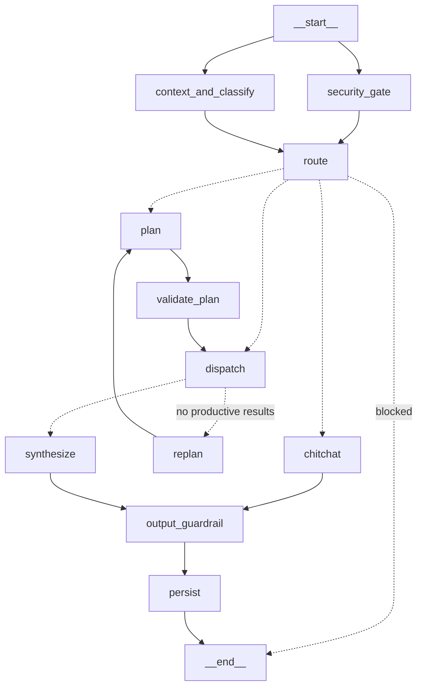

# Agent Architecture

Multi-agent **supervisor / orchestrator-workers** pattern. A central LangGraph
orchestrator owns control flow deterministically: it classifies the query, routes
to specialist agents, dispatches them (in parallel where possible), reflects on the
results, and synthesizes a single answer. Agents never call each other directly —
the supervisor coordinates, which keeps behavior predictable and debuggable.

## Pipeline

- **security_gate ∥ context_and_classify** run concurrently (two pre-routing LLM
  calls), joined at **route** — saves a round-trip.
- **route** branches: `blocked` (threat) → END; `chitchat` (DIRECT/REFUSE);
  `dispatch` (router produced a SIMPLE plan inline); `plan` (COMPLEX → planner).
- **dispatch** runs agents in topological parallel batches, then the **reflection
  gate** decides: escalate to the planner once (`replan`) if nothing productive
  came back, else **synthesize**.
- **output_guardrail** (PII redaction + prompt-leak backstop) → **persist**.

## Routing (query → agent)

Two-tier, cost-aware:

1. **Router / classify** (FAST lane, `RouterDecision` via structured output):
   returns `DIRECT | SIMPLE | COMPLEX | REFUSE` + `confidence`. For **SIMPLE** it
   generates the agent task inline and **bypasses the planner** — ~80% of queries
   never pay for a planning step.
2. **Planner** (FAST lane, ReAct) only for **COMPLEX**: decomposes into a DAG of
   self-contained agent tasks with `depends_on`.

Both router and planner read the **same** `registry.build_agent_catalog()` (full
descriptions + capabilities) — routing is never decided on truncated agent info.
REFUSE is **coverage-driven**: refuse only when no registered agent's domain covers
the request (so adding an agent expands scope without prompt edits). Structured
output guarantees a schema-valid decision; a text-parse fallback covers backends
without function calling.

## Execution modes (per agent)

Each `AgentSpec` declares how it runs (`registry.build_agents` wires it):

| Mode | How it runs | Use for |
|------|-------------|---------|
| `tool_call` | one direct call to `primary_tool`, **no ReAct loop** | pure-retrieval agents ("run one search and return") — cuts an LLM round-trip + its failure modes |
| `react` | full `create_react_agent` tool-reasoning loop | agents that chain/choose tools or do multi-step work |

Current wiring:

- `reports` — `tool_call` → `search_reports`. *Tradeoff:* narrows the agent to
  semantic search at runtime; the by-ID (`get_report_content`) and filter
  (`search_reports_by_filter`) paths are not exercised. Set `mode="react"` if those
  query types matter.
- `userguide` — `tool_call` → `search_user_guide`. Clean fit.
- `easm` — `react` (multi-step: asset queries, rescans with approval).

## Reflection loop

If **no** agent returns productive content (error, timeout, or a "no results"
response — see `_is_unproductive`), the gate escalates **once** to the planner
(`retry_count` caps it at 1). This recovers a mis-routed SIMPLE query by giving it a
second, fuller decision with all agents/tools visible. Bounded latency; only fires
on genuinely empty turns.

## Adding an agent

1. Define its tools.
2. `registry.register(AgentSpec(id=…, description=…, capabilities=…, mode=…,
   primary_tool=… if tool_call))` in `main._register_agents`.
3. Done — the router and planner auto-discover it via the catalog; the orchestrator
   auto-routes. No changes to routing prompts or graph.

## Evaluating routing

`tests/eval/` runs golden queries through the real orchestrator and asserts which
agents ran (DIRECT/REFUSE expect none). This is the routing regression gate —
`uv run python tests/eval/run_eval.py` (non-zero exit on failure). Extend
`golden_queries.json` whenever a new agent or an ambiguous boundary appears.

## Production properties

- Timeouts + graceful fallbacks at every node (fail-open security, default plan,
  friendly empty answer, structured→text router fallback).
- Streaming synthesis (token events from the synthesize/chitchat nodes).
- PII redaction + prompt-leak backstop on **all** answer paths.
- Multi-turn context: rolling summary + verbatim tail, fed to router, planner, and
  synthesis.
- Tenant isolation: every retrieval is org-scoped via the Qdrant access filter.

### Known limits / next steps

- Flat single-prompt routing scales to ~15–20 agents; beyond that, move to
  embedding-based agent retrieval or hierarchical routing.
- The reflection loop re-plans but doesn't yet critique answer *quality* (only
  presence of content). A judge pass is the natural next addition.
- `confidence` is logged but not yet used to auto-escalate low-confidence SIMPLE
  routes to the planner — an easy future lever.
